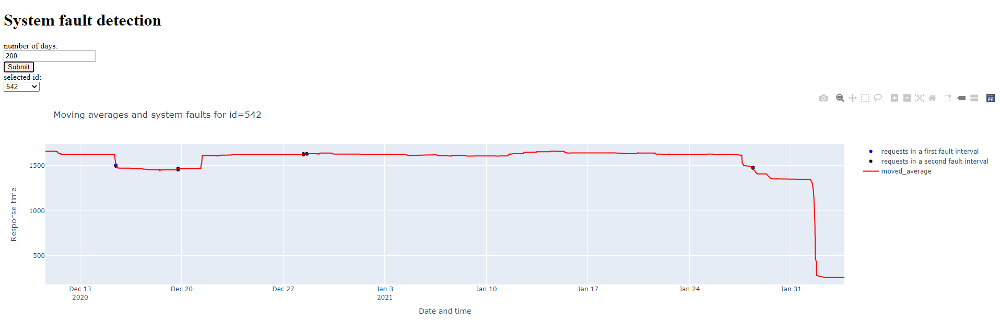

# sys-fault-detection

***
In this project, we study the incremental response times of sql_ids in order to determine system faults.

### How does it work?

***
It groups data into 10 minutes intervals and calculates the average of the response time in each interval. Afterward, it checks the behaviour of average response times in all time intervals of all sql_ids. By comparing average response times within 10-minute intervals for each sql_id, it determines the increments. The algorithm first determines whether within both intervals, and then the increment is marked. A valid interval is the one that has data. A variable is defined as an acceptance rate for available sql_ids. It is possible to say that there is a system fault in that specific time interval when the number of increments for two side-by-side intervals is greater than the acceptance rate multiplied by the number of valid side-by-side intervals.


### Main parameters
***
The parameters in the project:

- `sql_id`:  this parameter defines the id of sql request.
- `days_num`:it helps to show the data of the last specific days.
- `path_file`: the default path for the log file is in the resources folder. It can be changed by specifying this variable.
- `time_interval`: group all the data into a specific time interval. The default value is 10 minutes.
- `acceptance_rate`:a threshold for accepting the fault detection. If we decrease the value, the number of faults will be increased. This variable multiplied by the `valid_pair_intervals` variable will generate the minimum number of increments for considering two intervals as the fault.
- `min_valid_pair_intervals`: two pair intervals are defined as side-by-side intervals. We called them valid if we have data in both of the intervals. This variable specifies the minimum number of valid pair intervals which is required for the system fault detection.
- `windows_size`: to have a better graph, we calculate the moving average, and we show it with the plotly. This variable defines the size of the window of the moving average.

### How to work with it?
***
By running this project, you can see the figure of each sql_id with its system fault. So the requests should contain
two parameters: Number of days and selected id.

Example of requesting the figures:

```
  http://127.0.0.1:5000/test?sql_id=143&days_num=150
```

Result:


